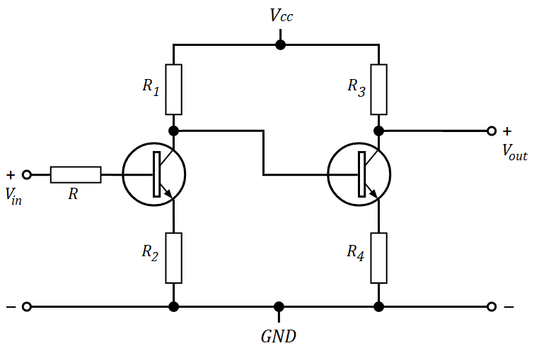
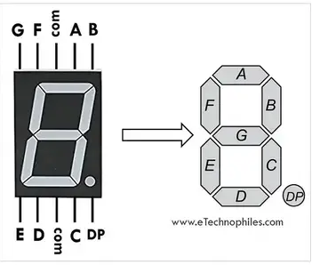
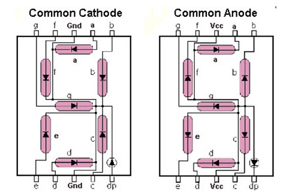
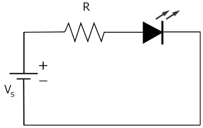
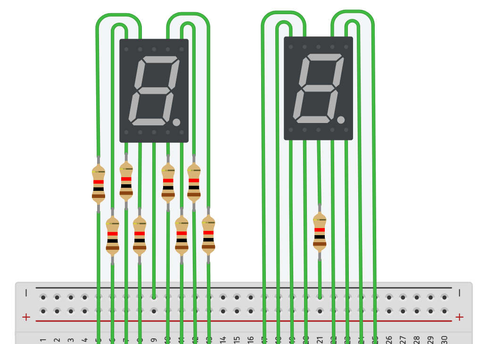
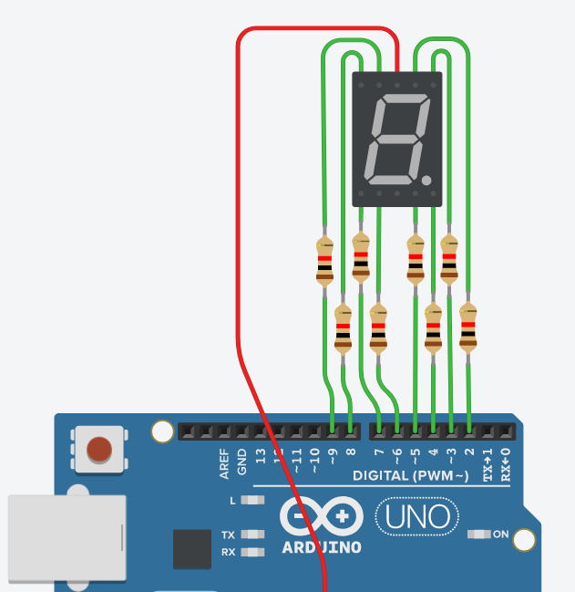
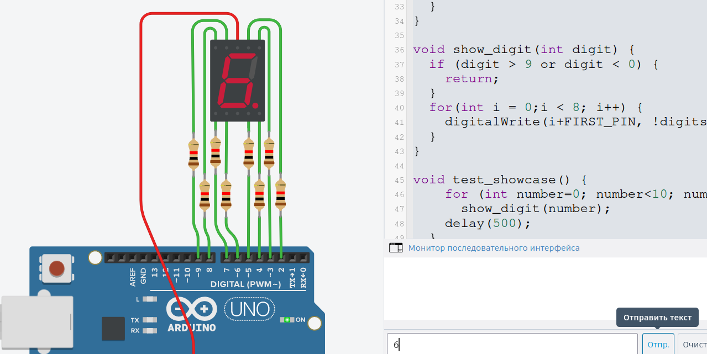
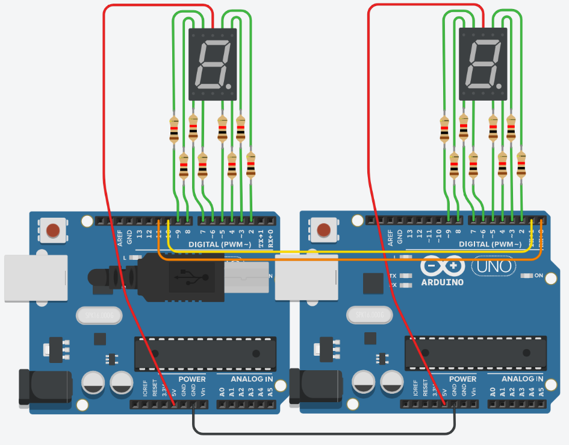

Каскадирование
==============

Вводные
-------

В электронике каскадирование имеет несколько смыслов. Например существует каскадные усилители, для достижения уровня сигналов, которые нельзя достичь сразу, например что получить на выходе сигнал усиленный в сто раз, нам нужно сначала увеличить сигнал в 20 раз, а потом еще в 5. При этом цепи которые усиливают сигнал могут принципиально не отличаться, но состоять из более "мощных" элементов. Пример каскадного усилителя (схема упрощена для иллюстрации) представлен ниже. Видно что элементы использованные в двух ступенях каскада одинаковые и вход второй ступени берется с первой.

Усилитель является примером "вертикального"  увеличения: сигнал сохраняет форму, но не с каждым шагом каскада увеличивается по амплитуде. Существуют так же применение каскадов элементов для "горизонтального" расширения возможностей, когда мы не получаем принципиально новых сущностей, но получаем больше того что у нас уже и так есть в системе. Один из примеров такого расширения (масштабирование) является увеличение количества пинов. 

Если рассмотреть плату Arduino Uno, у нас есть в распоряжении 14 цифровых пинов, два из которых занято под коммуникацию по протоколу UART с компьютером. Поэтому у нас в распоряжении есть 12 пинов, если мы хотим сохранить связь с компьютеров. Если мы хотим подключать больше перефирии, чем могут позволить количество пинов, которое есть у нас в распоряжении, нам придется что-нибудь продумывать, что получить больше пинов. 

Давайте рассмотрим учебный пример мы хотим сделать наборное устройство для вывода численной информации в виде бегущей строки.

Подготовка
----------

 Для это будем использовать семисегментый индикатор, который представляет из себя восемь (7 + 1) светодиодов, которые собраны в корпусе так чтобы можно было показывать цифры и некоторые символы если включить их в правильном порядке. Название семисегментый индикатор устоялось, однако на таком индикаторе есть восьмой элемент, точка, для управления которой так же используется отдельный контакт. 

Как видно из схемы мы используем восемь выводов (ножек) для управления сегментами и точкой,  они промаркированы буквами. Эти выводы мы будем подключать к цифровым пинам. Вывод COM является общим пином для всех сегментов, к нему подключается либо Vcc, либо GND, в зависимости от того как подключены светодиоды внутри индикатора. 

**Вопрос: какой уровень сигнала на пине (HIGH/LOW) включит сегмент в индикаторе при схеме с общим анодом (вывод COM подключен к Vcc) и катодом (вывод COM подключен к GND).**

Мы получили понимание об устройстве (семисегментном индикаторе), который будем использовать в качестве периферии. Теперь давайте поймем как подключить его к микроконтроллеру. Мы уже умеем работать с отдельными светодиодам. Нам нужен резистор чтобы ограничить ток, он подбирается в зависимости от напряжения и максимального тока через светодиод (для расчета используйте закон Ома). В схеме ниже мы можем отключить провод, соединяющий схему либо с "плюсом" либо с "минусом" и подключить его к пину, и таким образом сможем получить схему где мы можем управлять включением и отключением светодиода.

Семисегментный индикатор есть не что иное как восемь светодиодов в одном корпусе, аноды или катоды которых, подключены к общему выводу. Поэтому подключить его не составит труда. Нам также понадобятся резисторы и провода. Единственный вопрос который мы можем задать: должны ли подключить резистор на каждый сегмент или будет достаточно одного резистора на общем выводе.

**Вопрос: Какой номинал резисторов нужно выбрать в каждом случае. Над чем мы теряем контроль если оставить один резистор в схеме.**

Подключим индикатор к микроконтроллеру как показано ниже. Мы будем использовано пины со 2 по 9 включительно для управления светодиодами. Обратите внимание на общий вывод, в данном случае он подключен к плюсу (+5V на плате), т.е. у нас индикатор с общим анодом. Соответственно, для включения светодиодов мы должны установить LOW на пинах. 

Давайте разработаем схему для управления индикатором, на текущий момент мы хотим показывать цифры. Запишем соответствие пинов и сегментов, а так же схемой соответствия сегментов и цифры, которую нужно показать, как на рисунке ниже.

И получим массив, который будет содержать всю необходимую информацию для показа цифры.

.. code-block:: c++

    // 2 3 4 5 6 7 8 9
    // A B . C D E G F
    bool digits[10][8] = {
      {1,1,0,1,1,1,0,1},  // 0
      {0,1,0,1,0,0,0,0},  // 1
      {1,1,0,0,1,1,1,0},  // 2
      {1,1,0,1,1,0,1,0},  // 3
      {0,1,0,1,0,0,1,1},  // 4
      {1,0,0,1,1,0,1,1},  // 5
      {1,0,1,1,1,1,1,1},  // 6
      {1,1,0,1,0,0,0,0},  // 7
      {1,1,0,1,1,1,1,1},  // 8
      {1,1,1,1,1,0,1,1}   // 9
    };

Каждая строка этого массива будет соответствовать цифре равной индексу этой строки. Теперь мы готовы написать остальной код, который будет включать определенную цифру на индикаторе. 

.. code-block:: c++

    #define FIRST_PIN 2
    #define LAST_PIN 9
    
    //2 3 4 5 6 7 8 9
    //A B . C D E G F
    bool digits[10][8] = {
      {1,1,0,1,1,1,0,1},  // 0
      {0,1,0,1,0,0,0,0},  // 1
      {1,1,0,0,1,1,1,0},  // 2
      {1,1,0,1,1,0,1,0},  // 3
      {0,1,0,1,0,0,1,1},  // 4
      {1,0,0,1,1,0,1,1},  // 5
      {1,0,1,1,1,1,1,1},  // 6
      {1,1,0,1,0,0,0,0},  // 7
      {1,1,0,1,1,1,1,1},  // 8
      {1,1,1,1,1,0,1,1}   // 9
    };
    
    void setup(){
      for(int i = FIRST_PIN; i <= LAST_PIN; i++) {
        pinMode(i, OUTPUT);
        digitalWrite(i, HIGH);
      }
      //test_showcase();
      Serial.begin(9600);
    }
    
    void loop() {
    }
    
    void show_digit(int digit) {
      if (digit > 9 or digit < 0) {
        return;
      }
      for(int i = 0;i < 8; i++) {
        digitalWrite(i+FIRST_PIN, !digits[digit][i]);
      }
    }
      
    void test_showcase() {
        for (int number=0; number<10; number++) {
          show_digit(number);
        delay(500);
      }
    }

**Вопрос: зачем нужно `digitalWrite(i, HIGH)` в setup(). Почему мы должны использовать инвертированные значения из массива `!digits[number][i]`**

Делаем свой велосипед
---------------------

Мы готовы приступить к разработке нашего каскада. Напомним что мы хотим получить цифровое табло на котором будут отображаться цифры. Мы легко нагуглим, что для этого нам отлично подойдет что-то под название сдвиговый регистр и мы обязательно рассмотри его позже. Но для начала, давайте попробуем решить эту задачу, с имеющимися знаниями. Мы знаем что с платой можно общаться по UART (Serial). Мы уже делали это вручную и мы делали это с помощью скрипта. Мы знаем что пины 0 и 1 нельзя занимать так как на них "сидит" контроллер USB-UART и когда мы пишем `Serial.read()` или `Serial.write()` мы используем именно эти пины. Т.е. наш контроллер отправляет данные на эти пины, там их подхватывает USB-UART, конвертируем в USB и мы видим информацию на экране или ее получает наш скрипт на компьютере. Но что если будем отправлять информацию с "нашего" микроконтроллера, на другой напрямую? Мы можем предположить, что данные  уйдут как нужно, так как это все еще Serial. 

Хорошо. Мы получили схему и программу, которая позволяет управлять индикатором так, что мы увидим цифры. Давайте добавим немного интерактивности и сделаем, так что цифры будут устанавливаться в соответствии с командами пользователь. Общение будет происходить по UART (Serial). Как обычно, когда мы хотим что-то отправлять или получать с контроллера нам нужно прописать `Serial.begin(speed)` в `setup()`. В `loop()` добавим код, используя подход, который нам позволял и раньше получать команды от пользователя или управляющей программы, работающей на компьютере.

.. code-block:: c++

    void loop() {
      if(Serial.available()) {
        char user_input = Serial.read();
        int digit = (int)(user_input - '0');
        show_digit(digit);
      }
    }

Здесь мы воспользовались тем что символы имеют определенные коды и коды цифр идут последовательно, поэтому мы можем просто вычесть код символа 0 и привести к целому, это и будет той цифрой, которую нужно показать. Запустим код и убедимся, что все работает как мы задумали.

Мы получили данные с ПК и показали их на индикаторе. Неплохо. Теперь давайте подключим еще один микроконтроллер как мы обсудили выше и сделаем так, чтобы информация передавалась и ему, при этом компьютер будет общаться только с одним микроконтроллером - первым в цепочке, а он уже будет передавать данные второму. Так как мы не хотим терять связь с компьютером, на первой плате мы должны использовать "другой" Serial (не тот что сидит на пинах 0 и 1). В разных микроконтроллерах есть несколько встроенных обработчиков UART, т.е. они имеют аппаратное исполнение. При наличие аппартных UART предпочтительно использовать их. В Arduino UNO есть только один аппаратный UART, поэтому мы воспользуемся программной реализацией доступной из библиотеки `SoftwareSerial`. Необходимо создать объект и начать коммуникацию.

.. code-block:: c++
    
    #include <SoftwareSerial.h> 
    SoftwareSerial next_node(10, 11);

    void setup() {
      // previous code here
      // ...
      next_node.begin(9600);
    }

Мы должны указать пины, которые будут отвечать за прием (10) и передачу данных (11). Объект класса `SoftwareSerial` мы назовем `next_node` так как он будет отвечать за связь со следующим узлом в цепочке. Так как на втором контроллере мы не используем связь с компьютером, мы можем подключить 10 и 11 пин с первого микроконтроллера (используем next_node) к 1 и 0 пинам второго (используем Serial). Обратите внимание что нужно подключить Rx-Tx и Tx-Rx, иначе работать не будет. 

Так же нам нужно дополнить код получения данных с ПК, так что бы часть информации отправлялась на следующие узлы. Нам нужно считать один символ и оставить его себе остальное отправляем дальше по каскаду, где должна быть написана прошивка которая обработает входные данные.

.. code-block:: c++

    void loop() {
      if(Serial.available() >= 2) {
        char user_input = Serial.read();
        int digit = (int)(user_input - '0');
        show_digit(digit);
    
        while(Serial.available()) {
          next_node.write(Serial.read());
        }
      }
    }

Код второго микроконтроллера можно оставить таким же как код в конце предыдущей секции.

Мы видим, что есть несколько вещей которые мы можем исправить. Во-первых, сейчас у нас есть магическое значение 2, которая обозначает количество узлов в каскаде включая текущий узел. Таким образом мы вынуждены держать разные версии прошивки для разных узлов. Это не очень удобно. Решить эту проблему можно, если мы будем получать данные о количестве узлов от пользователя. Добавим в `setup()` код который подождет пока пользователь отправить данные о количестве узлов. Мы запоминаем эту информацию и если мы не последний узел в цепочке мы должны отправить это дальше, так как следующий узел тоже будет ждать этой информации и получит ее уже не от компьютер, а от предыдущего контроллера. 

.. code-block:: c++

    int num_nodes = 0;
    void setup() {
      // previous code here
      // ...
      char user_input = Serial.read();
      num_nodes = (int)(user_input - '0');
      if (num_nodes > 1) {
        next_node.write(user_input-1);
    }
    

Так же нам нужно немного поменять код в `loop()`, чтобы учитывать `num_nodes`. Т.е. мы заменили 2 на `num_nodes` и так же не будем отправлять данные дальше если мы последний узел в цепи. Ветка `else` нужна для того, что бы 

.. code-block:: c++

    void loop() {
      if(Serial.available() >= num_nodes) {
          // ...  
          while(num_nodes > 1 and Serial.available()) {
          next_node.write(Serial.read());
        }
      }
    }

Таким образом мы получим прошивку, которая будет одинакова для всех узлов.

.. code-block:: c++

    #include <SoftwareSerial.h>
    
    #define FIRST_PIN 2
    #define LAST_PIN 9
    
    int num_nodes = 0;
    //2 3 4 5 6 7 8 9
    //A B . C D E G F
    bool digits[10][8] = {
      {1,1,0,1,1,1,0,1},  // 0
      {0,1,0,1,0,0,0,0},  // 1
      {1,1,0,0,1,1,1,0},  // 2
      {1,1,0,1,1,0,1,0},  // 3
      {0,1,0,1,0,0,1,1},  // 4
      {1,0,0,1,1,0,1,1},  // 5
      {1,0,1,1,1,1,1,1},  // 6
      {1,1,0,1,0,0,0,0},  // 7
      {1,1,0,1,1,1,1,1},  // 8
      {1,1,1,1,1,0,1,1}   // 9
    };
    
    SoftwareSerial next_node(10, 11);
    
    void setup(){
      for(int i = FIRST_PIN; i <= LAST_PIN; i++) {
        pinMode(i, OUTPUT);
        digitalWrite(i, HIGH);
      }
      //test_showcase();
      Serial.begin(9600);
      next_node.begin(9600);
      while(Serial.available() == 0) {
      }
      char user_input = Serial.read();
      num_nodes = (int)(user_input - '0');
      if (num_nodes > 1) {
        next_node.write(user_input-1);
      }
    }
    
    void loop() {
      if(Serial.available() >= num_nodes) {
        char user_input = Serial.read();
        int digit = (int)(user_input - '0');
        show_digit(digit);
        while(num_nodes > 1 and Serial.available()) {
          next_node.write(Serial.read());
        }
      }
    }
    
    void show_digit(int digit) {
      if (digit > 9 or digit < 0) {
        return;
      }
      for(int i = 0;i < 8; i++) {
        digitalWrite(i+FIRST_PIN, !digits[digit][i]);
      }
    }
      
    void test_showcase() {
        for (int number=0; number<10; number++) {
          show_digit(number);
        delay(500);
      }
    }