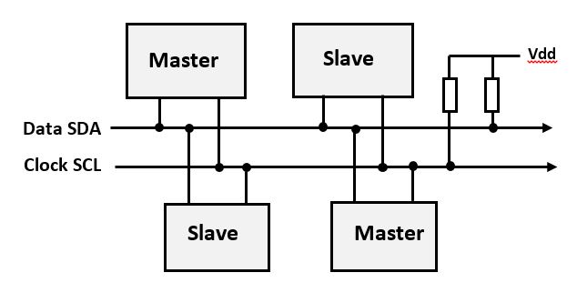
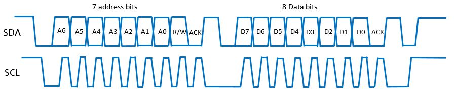

I2C
===

Введение
--------

I2C, что означает Inter-Integrated Circuit, представляет собой широко используемый протокол последовательной передачи данных для соединения различных электронных компонентов в системе микроконтроллера. Он был разработан компанией Philips (теперь NXP Semiconductors) и в настоящее время является протоколом отраслевого стандарта, поддерживаемым многими  производителями. Как и в случае с UART мы оперируем байтами, но в отличие от UART мы передаем не только данные, но и дополнительную информацию, которая позволяет осуществлять коммуникацию.

Ключевые особенности и характеристики протокола I2C представлены ниже:

    * Двунаправленная связь по двум проводам. I2C использует две линии для связи. Линия последовательных данных (SDA), по этой линии передаются фактические данные. Последовательная линия синхронизации (SCL), по этой линии передается тактовый сигнал, который синхронизирует передачу данных. **Вопрос: в чем отличие от UART?**

    * Архитектура **master-slave**. При использовании связи I2C есть главное устройство, которое инициирует связь, и одно или несколько подчиненных устройств, которые отвечают на запросы ведущего устройства. Главное устройство генерирует тактовый сигнал и определяет какое с каким slave будет осуществляться коммуникация. Передавать информацию может как master так и slave.

    * Адресация. каждому устройству на шине присвоен уникальный адрес, позволяющий выбрать конкретное ведомое устройство для связи. Это позволяет нескольким устройствам сосуществовать на одной шине. Данные будут получены всеми устройствами, но использоваться только тем, которому они были адресованы. **Вопрос: сколько битов составляют адрес?**

    * Синхронная связь. Связь является синхронной, что означает, что данные передаются на основе тактового сигнала, предоставленного ведущим устройством. **Что позволяло асинхронную связь при использовании UART?**

    * Условия запуска и остановки коммуникации: обмен данными начинается с условия запуска (переход с высокого на низкий уровень на линии SDA, когда уровень SCL высокий) и заканчивается условием остановки (переход с низкого на высокий уровень на линии SDA, когда уровень SCL высокий). 

    * Подтверждение (ACK) и неподтверждение (NACK). после отправки каждого байта получатель (master  или slave) отправляет бит подтверждения или неподтверждения, чтобы указать, успешно ли он получил данные.

    * Поддержка нескольких главных устройств. I2C поддерживает конфигурацию с несколькими главными устройствами, позволяющую нескольким главным устройствам сосуществовать на одной шине. Для управления конфликтами используются механизмы обнаружения и разрешения конфликтов.

    * Скорость передачи данных. Скорость передачи данных по шине I2C определяется скоростью переключения сигнала на линии SCL и определяется возможность всех устройств на шине.

I2C обычно используется для подключения различных компонентов, таких как датчики, EEPROM, часы реального времени и другие периферийные устройства во встроенных системах. Это универсальный и широко распространенный протокол благодаря своей простоте и эффективности подключения нескольких устройств к одной шине.

Передача 
--------

Как мы уже говорили данные передаются благодаря  переключению линий SCL и SDA. Для передачи данных master отправляет адрес подчиненного устройства, с которым оно хочет связаться. Адрес отправляется побитно, начиная со старшего бита (MSB). Для каждого бита адреса и данных, а также битов ACK, NACK линия SDA изменяется, в то время как линия SCL имеет низкий уровень, чтобы представить значение бита. Затем линия SCL переключается (переход от LOW к HIGH), сигнализируя о том, что бит готов к чтению.

Рассмотри пример работы с двумя устройствами.

.. code-block:: c++

    #include <Wire.h>

    void setup() {
      Serial.begin(9600);
      Wire.begin(); // join I2C bus as master no address needed
    }
    
    void loop() {
      // Send data to Arduino Board 2
      Wire.beginTransmission(9); // 9 is the slave address of Arduino Board 2
      Wire.write("Hello from master!");
      Wire.endTransmission();
    
      delay(1000);
    
      // Receive data from Arduino Board 2
      Wire.requestFrom(9, 32); // request 32 bytes from slave device with address 9
      while (Wire.available()) {
        char c = Wire.read();
        Serial.print(c);
      }
    
      Serial.println();
      delay(1000);
    }

На slave 

.. code-block:: c++

    #include <Wire.h>
    
    void setup() {
      Serial.begin(9600);
      Wire.begin(9); // join I2C bus as slave with address 9
      Wire.onReceive(receiveEvent);
    }
    
    void loop() {
      // Do something in the loop if needed
    }
    
    void receiveEvent(int length) {
      while (Wire.available()) {
        char c = Wire.read();
        Serial.print(c);
      }
    
      // Send data back to Arduino Board 1
      Wire.beginTransmission(8); // 8 is the address of Arduino Board 1
      Wire.write("Hello from slave!");
      Wire.endTransmission();
    }

