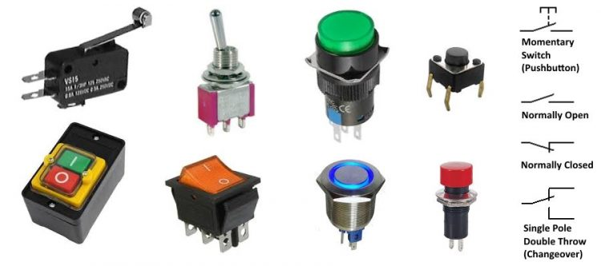
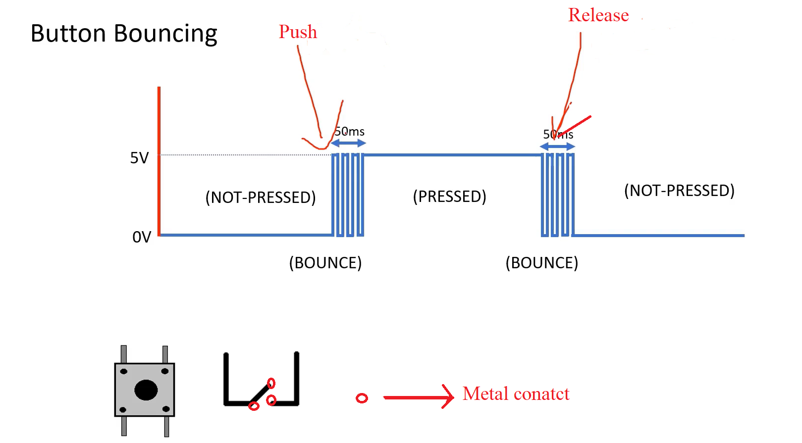
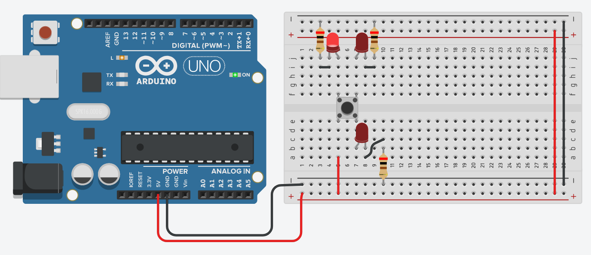
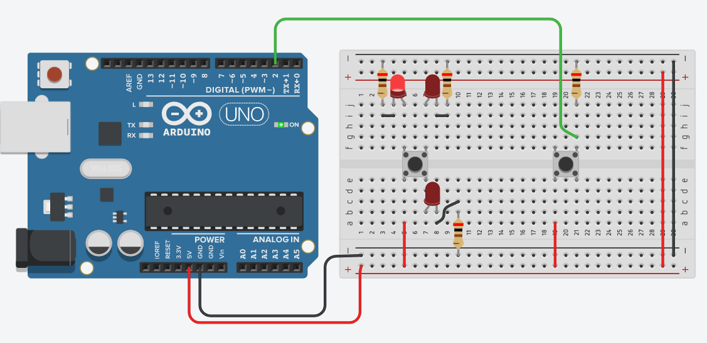
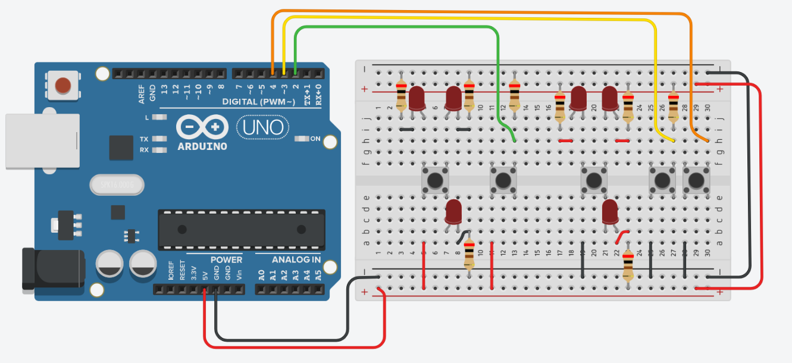
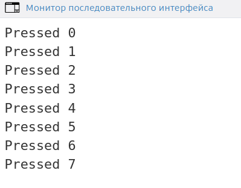
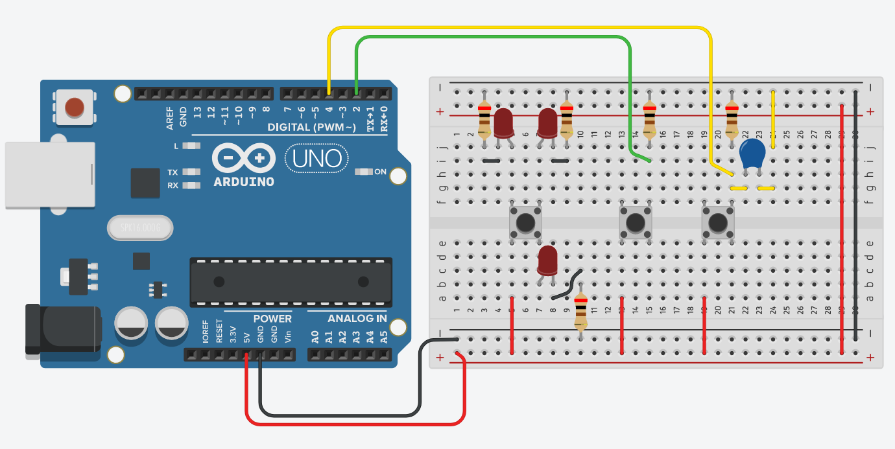
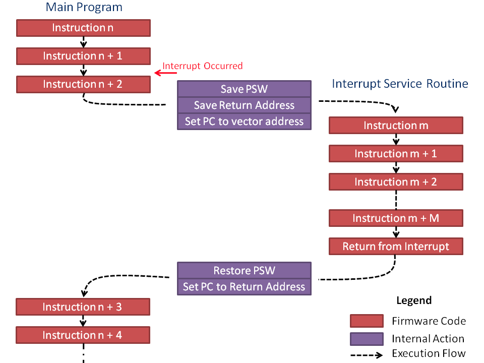
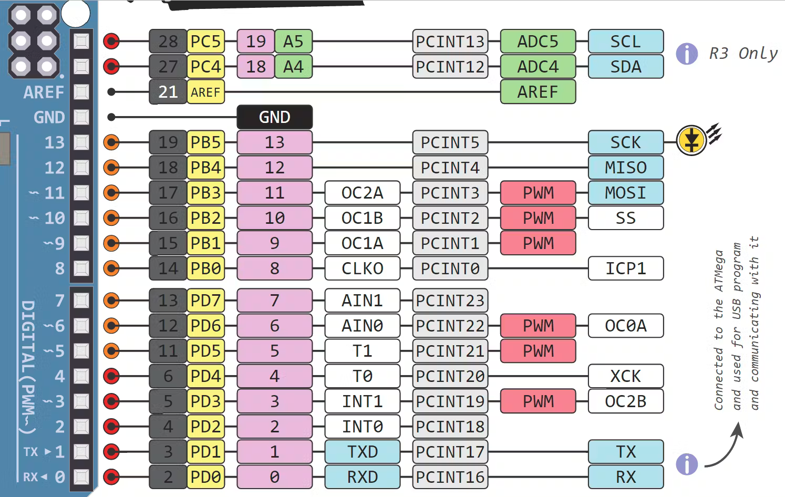

Датчики присутствия
===================

Здесь мы будем говорить о разных способах, которые могут нам помочь определить приблизился ли к нам какой либо объект. Мы можем использовать как свойства самого объекта, например издаваемый им шум или испускаемое им тепло, так и не основываться на особенностях этого объекта, а генерируя зондирующий сигнал самостоятельно, например измерять дальность до объекта с помощью ультразвука или лазерного луча, и делать вывод о том приближается ли он к той области пространства которая нас интересует. 

Кнопка
------

Да обычная кнопка. Кнопка это датчик, который может детектировать прикосновения или нажатие. Кнопку можно считать датчиком очень близкого действия. Мы можем расположить на конструкции так, чтобы она активировалась при определенном положении конструкции (например дверь закрыта) и таким образом детектировать определенные события (например дверь открылась). Ниже приведены несколько типов кнопок/переключателей, которые являются механическими по типу действия.

Что значит "механическими"? Это такие переключатели, в которых физически соединяются два проводника и таким образом цепь, в которой установлена кнопка, замыкается. Сигнал может пройти от одной клеммы в другую. Так как мы говорим об физическом соединении двух проводников, при работе с кнопками нам нужно учитывать такое явление как **дребезг**. Его можно легко понять, если представить себе как мы бьем молотком по наковальне, при это не сильно фиксируем руку. Когда произойдет удар, молоток отскочет и потом приземлиться на наковальню еще раз но с меньшей силой. Это может повториться несколько раз, пока молоток не окажется в состоянии покоя на наковальне. Это и есть дребезг. В сигнале мы можем его увидеть как быстрое переключение сигнала с логической единицы (HIGH) на логический ноль (LOW), прежде чем мы получим стабильный сигнал.

 
Если мы не будем учитывать, дребезг, мы можем получить в программе ложное срабатывание, т.е. посчитать одно нажатие (переход с LOW на HIGH) за несколько нажатий. Давайте попробуем подключить кнопку и посмотрим, как сделать из не датчик. Для начала разберемся какие контакты кнопки будут менять свое состояние в зависимости от того нажата кнопка или нет (ведь именно это нам нужно от датчика: чтобы он менял свое состояние в зависимости от окружающей среды)

Мы видим что левый верхний светодиод светиться независимо от того нажата кнопка или нет. Правый верхний и правый нижний светодиоды не светятся и будут светиться только если, кнопка будет нажата. Именно эти контакты меняют свое состояние в зависимости от нажатия и их нам нужно использовать для того, что бы сделать датчик. Уберем светодиоды, и соединим вывод кнопки через резистор к GND (**Не забываем про резистор, чтобы не было короткого замыкания**). Резистор так же нужен чтобы гарантировать LOW когда кнопка открыта (есть контакт с GND) и HIGH когда кнопка закрыта (чтение происходит до резистора и поэтому место где считывается сигнал электрически ближе к 5В чем к GND).

Загрузим на плату код ниже и попробуем нажать на кнопку.

.. code-block:: c++

    #define BUTTON_PIN 2
    
    int previous_read = 0;
    
    void setup(){
      pinMode(BUTTON_PIN, INPUT);
      Serial.begin(9600);
    }
    
    void loop(){
      int val = digitalRead(BUTTON_PIN);
      if(val == 1 and previous_read == 0) {
        Serial.println("Pressed ");
        previous_read == val;
      }
    }

Мы так же можем подключить кнопку не к высокому уровню сигнала, а к земле, и через резисторы к высокому уровню. Тогда уровень, который отвечает за нажатое состояние (кнопка закрыта) будет LOW, а когда кнопка не нажата мы будем считывать HIGH. Т.е. режим работы инвертирован. Когда резистор соединяет сигнал с высоким уровнем напряжения, мы говорим что это **подтягиваяющий (PULLUP)** резистор, когда наоборот резистор соединяет сигнал с землей, мы говорим что это **стягивающий (PULLDOWN)** резистор Оба этих режима равнозначны, если не использовать внутренние возможности микроконтроллера. Дело в том что в микроконтроллере есть встроенные резисторы, которые соединяют пины с высоким уровнем напряжения т.е. являются PULLUP резисторами, и существует режим настройки пинов, который называется INPUT_PULLUP, что позволяет нам, на первый взгляд, не замыкать цепь, но она будет замкнута внутри микроконтроллера (см. самую правую кнопку). PULLDOWN резисторов в микроконтроллере, на базе которого построен Arduino UNO, нет. Поэтому мы можем упростить себе схему и воспользоваться INPUT_PULLUP.

Посмотрим как это работает. В коде ниже мы использовали массивы для того чтобы хранить состояния кнопок, уровень сигнала для состояния "нажата", предыдущих значений и режимов работы пинов:

.. code-block:: c++

    const int num_buttons = 3;
    uint8_t button_pins[num_buttons] = {2,3,4};
    bool button_press[num_buttons] = {
      HIGH, LOW, LOW
    };
    uint8_t button_mode[num_buttons] = {
      INPUT, INPUT, INPUT_PULLUP
    };
    bool previous[num_buttons] = {0, 0, 0};
    
    void setup(){
      for(int i = 0; i < num_buttons; i++) {
        pinMode(button_pins[i], button_mode[i]);
      }
      Serial.begin(9600);
    }
    
    void loop(){
      for(int i = 0; i < num_buttons; i++) {
        int val = digitalRead(button_pins[i]);
        if(val == button_press[i] and 
           previous[i] != button_press[i]) {
          Serial.println("Pressed button #" + String(i));
        }
        previous[i] = val;
      }
    }

К сожалению симуляции дребезга нет в tinkercad. Но мы можем воспользоваться `другим симулятором <https://wokwi.com/projects/288681423014986248>`_, который воспроизводит данные эффект (и конечно лучше убедиться в этом, собрав схему с кнопкой у себя на столе). В мониторе последовательного порта мы видим, что вместо одного нажатия мы получили 7, так как мы не учли дребезг и считали каждый переход с LOW на HIGH нажатием ``if(val == 1 and previous_read == 0)``.

Мы можем поправить дребезг аппаратно, добавив элемент, который будет сглаживать скачки, но при этом не будет мешать сигналу, когда он установится. Таким элементом для цепей постоянного тока является конденсатор. Можно рассматривать его как резервуар, который легко заполняется когда он пустой, но когда он заполнен то участок, который его содержит просто выпадает из цепи. В промежуточном состоянии (когда заполнен/заряжен частично) он будет так же заполняться  но уже не так сильно как если бы был пустой. Это делает конденсатор хорошо подходящим для наших задач.

Мы так же можем устранить дребезг программно, опросив кнопку спустя некоторое время достаточное для того, чтобы положение контактов зафиксировалось (на рисунках выше 50 мс). Самое простое решение это проблемы, может выглядеть так:

.. code-block:: c++

    #define BUTTON_PIN 4
    #define DEBOUNCE_TIME 50
    
    int previous_read = 0;
    long int press_time = 0;
    bool check_press = false;
    
    void setup(){
      pinMode(BUTTON_PIN, INPUT_PULLUP);
      Serial.begin(9600);
    }
    
    void loop(){
      int val = digitalRead(BUTTON_PIN);
      if(val == 0 and previous_read == 1) {
        press_time = millis();
       	check_press = true;
      }
      if(check_press == true and
         millis() - press_time > DEBOUNCE_TIME and
         digitalRead(BUTTON_PIN) == 0) {
        Serial.println("Pressed");
        check_press = false;
      }
      previous_read = val;
    }

На этом этапе мы смогли устранить дребезг и убедиться, что действительно кнопка была нажата. Мы можем получить больше информации, например количество нажатий и время, которое мы удерживаем кнопку. Для подсчета времени удержания нам нужно завести еще одну переменную, и назовем ее ``hold_time``, в нее мы будем записывать текущее время минус время нажатия (``press_time``) и делать это будем только если нажатие действительно было.

.. code-block:: c++

    #define BUTTON_PIN 2
    #define PRESSED HIGH
    #define BOUNCE_TIME 50
    
    int press_count = 0;
    int previous = 0;
    long int hold_time = 0;
    long int press_time = 0;
    bool check_press = false;
    bool button_pressed = false;
    
    void setup(){
      pinMode(BUTTON_PIN, INPUT);
      Serial.begin(9600);
    } 
    
    void loop() {
      // press event candidate
      int val = digitalRead(BUTTON_PIN);
      if(check_press == false and
         val == PRESSED and 
         previous != PRESSED) 
      {
        hold_time = 0;
        press_time = millis();
        check_press = true;
      }
      // debounce
      if(check_press == true and 
         millis() - press_time > BOUNCE_TIME) 
      {
        if(digitalRead(BUTTON_PIN) == PRESSED){
          button_pressed = true;
          press_count++;
          //Serial.print("Button is pressed ");
          //Serial.println(press_count);
        } else {
          check_press = false;
        }
      }
      // hold time counter
      if(button_pressed == true) {
      	hold_time = millis() - press_time;
        //Serial.print("Button is hold ");
        //Serial.println(hold_time);
      } 
      // released event
      if(button_pressed == true and
         previous == PRESSED and
         val != PRESSED) 
      {
        //Serial.print("Button is released ");
        button_pressed = false;
        check_press = false;
      }
      previous = val;
    }

Это будет хорошо работать, если нам не нужно ничего больше делать кроме опроса кнопки и если мы не будем совершать длительных операций по ее нажатию. Мы можем легко симулировать это добавить ``delay(2000)`` самой первой инструкцией в ``loop()``. Для того чтобы работать с кнопкой в окружении кода, который делает еще много чего и не пропускать нажатия, нам понадобятся аппаратные прерывания. Прерывания помогают нам прервать обычный ход программы и выполнить инструкции, которые нужно выполнить здесь и сейчас. Параллельности у нас по-прежнему нет, но мы может отвлечь микроконтроллер на более важные дела по событию, так как мы не знаем когда будет нажата кнопка. 

Обратимся к распиновке микроконтроллера на примере Arduino UNO и посмотрим, какие пины поддерживают прерывания (interrupts).

Мы видим ``INT0`` и ``INT1`` на пинах 2 и 3 и PCINTx на других цифровых пинах. Это значит, что пины 2 и 3 имеют индивидуальные обработчики прерываний, в то время как другие делят один обработчик между собой. Прерывания могут быть настроены на появление одного из событий: RISING, FALLING, CHANGE, LOW, HIGH (в Arduino UNO последнее не применяется). Нам подходит RISING или FALLING в зависимости от того как подключена кнопка. Мы не хотим делать ничего длительного, когда обрабатываем прерывание, в идеале мы должны просто изменить состояния, которые позже обработаем в основной программе, поэтому не весь код из ``loop()`` мы перенесли в ``check_button()``. Ниже мы использовали ``attachInterrupt()`` на обработчик прерываний 0 (пин 2), по событию ``RISING`` и сказали что нужно выполнить фукнцию ``check_button()`` когда наступит событие. Обратите внимание, что мы добавили ``volatile`` к описанию переменных, которые используются при обработке прерываний (подробнее смотрите `здесь <https://stackoverflow.com/questions/55278198/is-volatile-needed-when-variable-is-only-read-during-interrupt>`_).

.. code-block:: c++

    #define BUTTON_PIN 2
    #define DEBOUNCE_TIME 50
    
    volatile long int press_time = 0;
    volatile bool check_press = false;
    
    void setup(){
      pinMode(BUTTON_PIN, INPUT);
      Serial.begin(9600);
      attachInterrupt(0, check_button, RISING);
    }
    
    void loop(){
      if(check_press == true and 
         millis() - press_time > DEBOUNCE_TIME and
         digitalRead(BUTTON_PIN) == 1) {
        Serial.println("Pressed");
        check_press = false;
      }
    }
    
    void check_button() {
      if(check_press == false) {
        press_time = millis();
        check_press = true;
      }
    }

