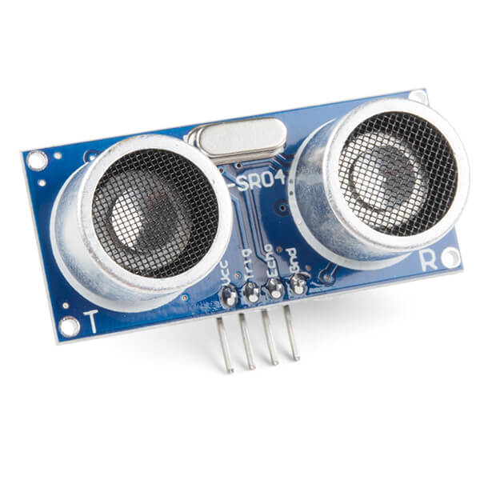

Дальномеры
==========

Мы уже рассмотрели работу с кнопками. Кнопку можно считать датчиком присутствия самого ближнего действия, т.е. нам нужно физически нажать на нее, чтобы она сработала и мы могли считать этот сигнал с помощью микроконтроллера. Кнопка является **пассивным** датчиком - она не испускает никакой сигнал сама, и от пользователя требуется определенное действие (нажать на кнопку). Это бывает не всегда удобно, поэтому сегодня рассмотрим датчики, которые позволят нам определять наличие объектов на удалении от датчика. Так же эти объекты не должны взаимодействовать с датчиком сами по себе, за счет того что мы будем использовать **активный** датчик, который сам будет генерировать зондирующий сигнал и по ответу поймет, что в поле его зрения что-то изменилось.

Датчик линии
------------

Мы продолжим описывать датчики по степень дальности объектов, которые они могут детектировать. Начнем с **датчика линии**. Датчик линии часто использует инфракрасный (ИК) сигнал для того, чтобы зондировать окружающую среду. Датчики линии, получил такое название, так как обычно используется в робототехнике и автоматизации, чтобы позволить роботу отслеживать контрастную линию на земле и следовать по определенному пути. Эти датчики обычно состоят из набора инфракрасных светоизлучающих диодов (светодиодов) и светопринимающих диодов (фотодиодов).

Работа датчика линии может быть описана следующим образом:

 * Инфракрасный светодиод излучает инфракрасный свет.
 * Свет подает на поверхность рядом с датчиком, например, на белую поверхность с черной линией.
 * Свет отражается по разному от разных участков поверхности (от светлого -сильнее). Темная поверхность поглощает свет, и отражается лишь небольшая часть.
 * Фотодиоды (который так же как и фоторезисторы чувствительны к освещенности) размещаются рядом с инфракрасными светодиодами, но отгорожены стенкой, так чтобы принимать не прямой свет, а только отраженный. 
 * В зависимости от того какой датчик линии мы используем, аналоговый или цифровой, мы будем получать разную информацию на выходе. Работа с аналоговым датчиком похоже на работу с датчиком освещенности на основе фоторезистора. Цифровой датчик отдает 0 или 1. Чтобы получить на выходе 1 мощность излучения должна превысить порог, который настраивается в зависимости от приложения. Для настройки порога обычно используется потенциометр на датчике.    

Ниже пример работы с аналоговым датчиком:

.. code-block:: c++
    
    const int sensor_pin = A0;  
    // Define THRESHOLD during calibration
    const int THRESHOLD = 500;  
    
    void setup() {
      Serial.begin(9600);
    }
    
    void loop() {
      int sensor_val = analogRead(sensor_pin);  
    
      // Compare the sensor value with the threshold
      if (sensor_val < THRESHOLD) {
        Serial.println("Detected line!");  
      } else {
        Serial.println("No line detected.");
      }
    }

Ниже пример работы с цифровым датчиком (порог выставляется потенциометром на датчике):

.. code-block:: c++

    // Check what state correspond to detection for your sensor
    #define DETECTED LOW
    const int sensor_pin = 2;
    
    void setup() {
      Serial.begin(9600);
      pinMode(sensor_pin, INPUT);
    }
    
    void loop() {
      int sensor_val = digitalRead(sensor_pin);  
    
      if (sensor_val == DETECTED) {
        Serial.println("Detected line!");  
      } else {
        Serial.println("No line detected.");
      }
    }

Инфракрасный дальномер
----------------------
    
Пару светодиод/фотодиод можно снабдить специальным корпусом и линзами, для того, чтобы получать информацию не только о цвете поверхности или о том есть ли в поле зрения датчика что-то что может отразить свет или нет, но и о расстоянии до объекта. 

Мы видим, что свет отраженный от объектов на разном расстоянии попадает на разные части фотодиода (приемника), и за счет этого мы можем определить расстояние до этого объекта. Расстояние и мощность сигнала связаны нелинейно. Мы видим что одному и тому же уровню напряжения соответствует две дальности, с этим связно наличие ограничения на минимальную дистанцию, которую может измерить датчик.

.. image:: ../../graphics/sharp_range_voltage.png
  :width: 600
  :alt: Зависимость напряжение (аналогового выхода) от дальности https://community.robotshop.com/forum/t/sharp-ir-distance-sensor-improvement/13054

Подключается датчик очень просто для этого нужно обеспечить его питанием и подкючить один сигнальный провод.

Для работы с датчиком нужно считать с него аналоговые измерения (напряжение) и привести по формуле к расстоянию. В коде ниже предполагает что датчик подключени к пину ``A0``. Обратите внимание что формула для приведения напряжения, ``sensor_val``, к расстоянию будет зависеть от модели датчика.

.. code-block:: c++

    const int sensor_pin = A0;
    
    void setup() {
      Serial.begin(9600);
    }
    
    void loop() {
      int sensor_val = analogRead(sensor_pin);
    
      // Convert the analog value to distance DEPENDS ON SENSOR
      float distance = 10650.08 * pow(sensor_val, -0.935) - 10;
    
      Serial.print("Distance: ");
      Serial.print(distance);
      Serial.println(" cm");
      delay(100);
    }
    

Ультразвуковой дальномер
------------------------

Ультразвуковые датчики приближения (ультразвуковые дальномеры) работают излучая и принимая ультразвуковые звуковые волны. Эти датчики используют время распространения ультразвуковых импульсов до объекта и обратно для измерения расстояния между датчиком и объектом без физического контакта. Так как используется зондирующий сигнал, который генерирует сам датчик, то он считается **активным**. Так же как инфракрасный дальномер, у датчика есть передатчик и приемник, но у же не света, а звуковых волн.

Вот пошаговое объяснение того, как работают ультразвуковые датчики приближения:

 * Датчик оснащен пьезоэлектрическим преобразователем, который генерирует ультразвуковые волны при подаче напряжения. Этот преобразователь действует как передатчик (ультразвуковой динамик). Передатчик активируется с помощью пина ``Trig``.

 * Датчик излучает короткий пакет ультразвуковых волн в форме импульсов. Этот импульс проходит по воздуху от датчика и может достичь целевого объекта.

 * Когда ультразвуковой импульс сталкивается с объектом, он отражается от поверхности объекта обратно к датчику. Отраженный импульс иногда называют эхом. Отраженного сигнала может не быть, если поверхность объекта, например ткань, поглощает сигнала.
 
* Такой же пьезоэлектрический преобразователь, который служил передатчиком, теперь действует как приемник (ультразвуковой микрофон). Он принимает отраженные ультразвуковые волны (эхо), когда они возвращаются к датчику, и преобразует его в электрический сигнал. При наличие отраженного сигнала на пине ``Echo`` будет изменен сигнал, который мы должны считать в микроконтроллере.

Датчик измеряет НЕ измеряет время, необходимое ультразвуковому импульсу для прохождения от передатчика к объекту и обратно к приемнику. Это нужно сделать с помощью прошивки микроконтроллера. Мы используем время распространения сигнала для определения расстояния до объекта. Используя скорость звука в воздухе (которая составляет примерно 343 метра в секунду или 0,0343 сантиметра в микросекунду при комнатной температуре), мы можем рассчитать расстояние до объекта:

Distance = (Round trip time) × (Speed of Sound) / 2

    Некоторые датчики могут обладать отличной от HC-SR04 схемой работы и, например производить расчет расстояния самостоятельно, отдавая расстояние напрямую.

Используя эту схему нетрудно написать код для получения расстояния с помощь. этого датчика.

.. code-block:: c++

    const int trig_pin = 9;  // transmitter
    const int echoPin = 10; // receiver
    
    void setup() {
      Serial.begin(9600);
      pinMode(trig_pin, OUTPUT);
      pinMode(echoPin, INPUT);
    }
    
    void loop() {
      // Trigger the ultrasonic: set 10us of HIGH on trig_pin
      digitalWrite(trig_pin, LOW);
      delayMicroseconds(2);
      digitalWrite(trig_pin, HIGH);
      delayMicroseconds(10);
      digitalWrite(trig_pin, LOW);
    
      // Wait ultrasonic pulse to return
      unsigned long duration = pulseIn(echoPin, HIGH);
    
      // Calculate the distance in centimeters using the speed of sound
      // (343 meters per second or 0.0343 centimeters per microsecond)
      float distance_cm = duration * 0.0343 / 2.0;
    
      Serial.print("Distance: ");
      Serial.print(distance_cm);
      Serial.println(" cm");
    
      delay(100); 
    }
     